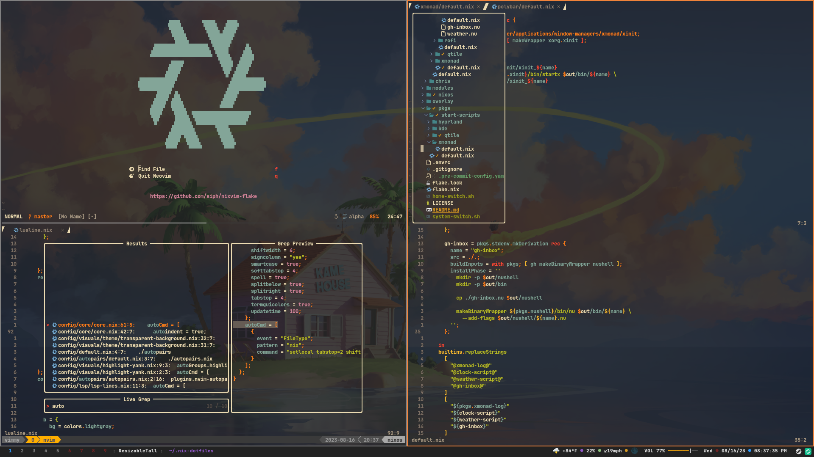

Neovim configuration build using [nixvim](https://github.com/pta2002/nixvim)
complete with lsp, treesitter, and more.

## Screenshot


## How to Run

You can run this directly from the command line with:
```shell
# Full featured version
nix run github:siph/nixvim-flake

# Lighter version without lsp.
nix run github:siph/nixvim-flake#lite
```

You can also plug this into a flake to include it into a system configuration.
```nix
{
  inputs = {
    chris-neovim.url = "github:siph/nixvim-flake";
  };
}
```

This input can then be used as an overlay to replace the default neovim.
```nix
{
    overlays = (final: prev: {
      neovim = inputs.chris-neovim.packages.${system}.default;
    });
}
```
Check my [system configuration](https://github.com/siph/nix-dotfiles) for more
information on this method.
